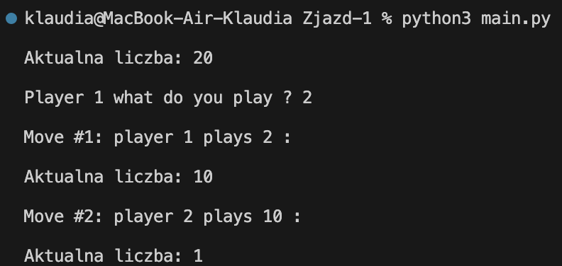

# Gra w Podział

Deterministyczna gra dwuosobowa o sumie zerowej.

## Zasady

- Startujemy z liczbą `n`.
- Na zmianę gracze dzielą liczbę przez dowolny dzielnik > 1.
- Przegrywa gracz, któremu zostanie 1.

## Uruchomienie

```bash
pip3 install -r requirements.txt
python3 main.py
```

## Screenshot


