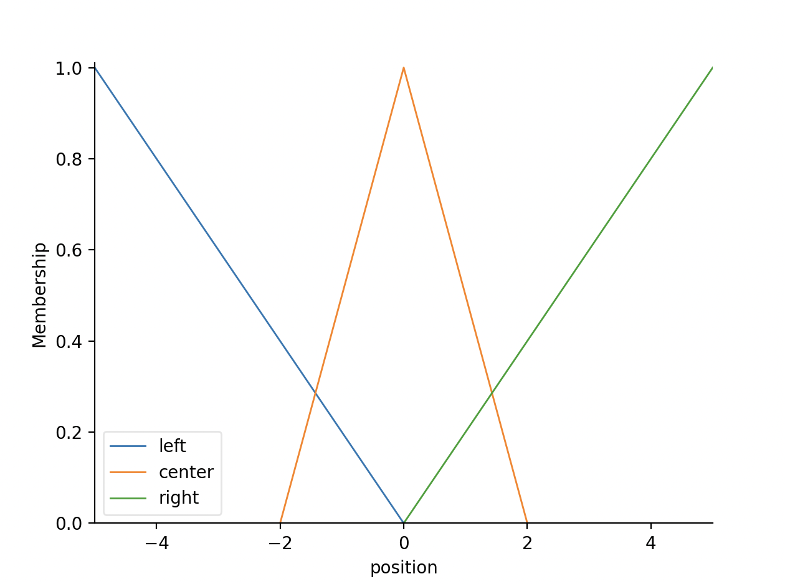

# Fuzzy Invented Pendulum

Prosty system sterowania odwróconym wahadłem (CartPole) z użyciem **logiki rozmytej** w języku Python. Celem jest utrzymanie wahadła w pozycji pionowej poprzez odpowiednie sterowanie siłą działającą na wózek.

## Zasady

System przyjmuje **trzy wejścia**:
- `angle` – kąt wahadła (°)
- `angular_velocity` – prędkość kątowa (°/s)
- `position` – pozycja wózka (m)

oraz generuje **jedno wyjście**:
- `force` – siła sterująca (ujemna = w lewo, dodatnia = w prawo)

Działanie systemu opiera się na zbiorach rozmytych i regułach typu IF–THEN (np. *Jeśli kąt jest „right” i prędkość kątowa jest „positive”, to siła = „left”*).

## Uruchomienie

1. Zainstaluj wymagane biblioteki:

```bash
pip3 install -r requirements.txt
```

2. Uruchom symulację:

```bash
python3 main.py
```

## Screenshot

Przykładowy wykres funkcji przynależności wyjścia (**force**) po defuzyfikacji:


