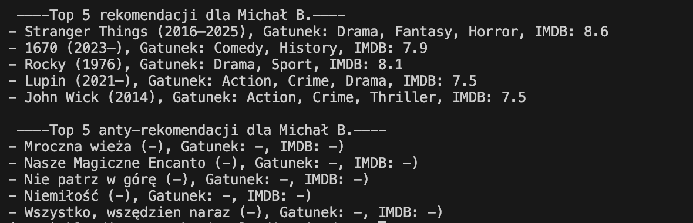
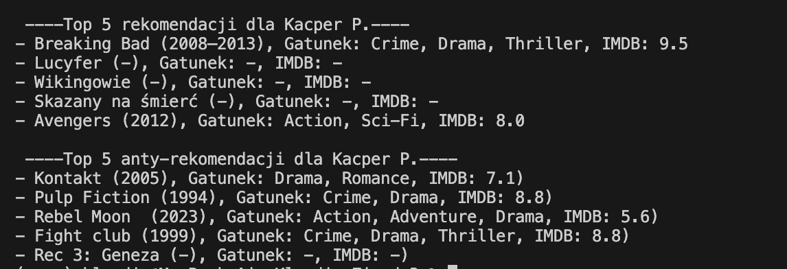
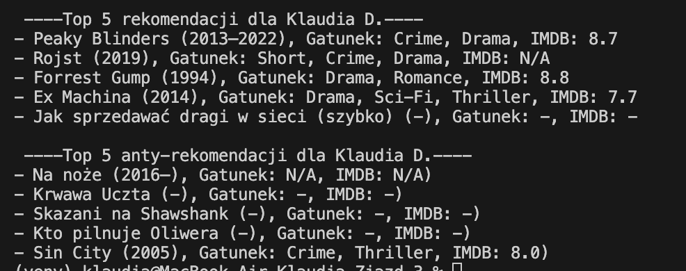

# Silnik rekomendacji filmów i seriali

## Opis
Projekt implementuje **silnik rekomendacji filmów i seriali** w Pythonie.  
Używa filtracji współrzędnych (collaborative filtering), aby sugerować filmy, które mogą spodobać się użytkownikowi na podstawie ocen innych użytkowników, oraz filmy, których użytkownik powinien unikać (antyrekomendacje).  

Projekt pobiera również dodatkowe informacje o filmach z **OMDb API** (rok produkcji, gatunek, ocena IMDb).  

---

## Funkcjonalności
- Wczytywanie ocen użytkowników z pliku JSON.
- Tworzenie macierzy użytkownik–film.
- Obliczanie podobieństwa użytkowników za pomocą cosine similarity.
- Rekomendacja 5 filmów, które mogą spodobać się użytkownikowi.
- Rekomendacja 5 filmów, których użytkownik powinien unikać (antyrekomendacje).
- Pobieranie dodatkowych informacji o filmach z OMDb API.

---

## Wymagania
- Python
- Klucz API OMDb ([uzyskaj tutaj](https://www.omdbapi.com/apikey.aspx))

---

## Instalacja i uruchomienie

1. (Opcjonalnie) Stwórz i aktywuj wirtualne środowisko:

```bash
python3 -m venv venv
source venv/bin/activate
```

2. Zainstaluj wymagane biblioteki:

```bash
pip3 install -r requirements.txt
```

3. W pliku main.py wprowadź swój klucz OMDb API:

```bash
OMDB_API_KEY = "twój_klucz_api"
```

4. Uruchom plik

```bash
python3 main.py
```

## Scenariusze




